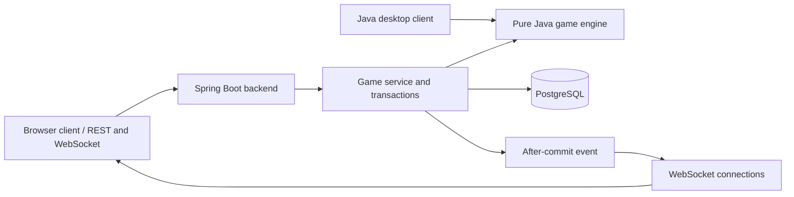

# Nine Men's Morris

[](https://github.com/hannnz1/nine-mens-morris-java/actions/workflows/ci.yml)

**A browser-based multiplayer board game powered by a shared Java rules engine and a Spring Boot backend.**

Nine Men's Morris is a refactored, multi-module Java application that separates game rules from presentation and persistence. The desktop client and Spring Boot API share a framework-independent domain engine. The backend adds persistent multiplayer sessions, player-token authorization, pessimistic row locking, stale-state checks, idempotent actions and real-time updates. A browser client provides a playable board using REST actions and native WebSocket subscriptions, with no frontend build step or CDN dependency.

**Java 17 · Spring Boot · PostgreSQL · JPA / Hibernate · SQL · WebSocket · Maven · Docker**

[Live demo](https://morris.hanzhu-lab.online/) · [Web client](#web-client) · [Play locally](#play-in-the-browser) · [Quick start](#quick-start) · [Architecture](#architecture) · [API walkthrough](#try-the-rest-api) · [Tests](#build-and-test) · [Code guide](#code-guide)

## Web Client

The current web frontend is included in this repository and served by the backend at **`http://localhost:8080/`** after local startup. It is the main browser entry point for creating and joining matches.

| Screen / interaction | What the client provides |
| --- | --- |
| Create or join | Enter a player name, create a match as White, or join by game ID as Black |
| Interactive board | 24 board positions, legal-action highlights, source selection, placement and removal |
| Match panel | Player names, active side, game phase, unplaced and on-board piece counts |
| Real-time connection | WebSocket updates, connection status and WebSocket reconnect |
| Session controls | Tab-local credential storage, snapshot refresh, copy invitation link and return with identity preserved |
| Responsive layout | HTML, CSS and JavaScript packaged with Spring Boot; no separate frontend build |

**Frontend source:** [HTML](backend/src/main/resources/static/index.html) · [CSS](backend/src/main/resources/static/styles.css) · [JavaScript](backend/src/main/resources/static/app.js)

To open the web client locally:

```powershell
git clone https://github.com/hannnz1/nine-mens-morris-java.git
cd nine-mens-morris-java
Copy-Item .env.example .env
# Configure .env for your environment before starting.
docker compose up --build -d
# After the API is healthy, open http://localhost:8080/ in your browser.
```

See [Play in the browser](#play-in-the-browser) for the two-player walkthrough. GitHub displays the source and this README; it does not run the Spring Boot server, PostgreSQL database or WebSocket connection. The localhost address refers to your own running instance, not a hosted public demo.

## Project Highlights

| Capability | Implementation | Purpose |
| --- | --- | --- |
| Browser gameplay | Responsive 24-position board, legal-move highlighting, session restoration and reconnect | Plays against the same backend and rules engine |
| Shared domain model | Framework-independent Java rules engine | Keeps desktop and backend rule behavior in one place |
| Multiplayer lifecycle | Create a waiting game, join as the second player, submit actions | Separates match creation from player participation |
| Concurrent updates | Per-game `PESSIMISTIC_WRITE` lock and client `expectedVersion` | Serializes writes to one game and rejects actions based on stale boards |
| Retry-safe actions | Per-game idempotency keys and request fingerprints | Replays a saved response for an identical retry; rejects conflicting key reuse |
| Transactional persistence | Game state and idempotency record in one transaction | Keeps the move and its retry record consistent |
| Real-time delivery | Authenticated native WebSocket subscriptions; notifications after commit | Publishes committed game state to connected players |
| Player credentials | Random tokens, stored as SHA-256 digests | Authorizes actions and subscriptions without storing raw credentials |
| Reproducible development | Maven modules, one SQL initialization script, automated tests, CI and Docker Compose | Provides a repeatable build and local deployment workflow |

## Game Rules

Two players take turns placing nine pieces on a 24-position board. Completing a line of three creates a **mill**, allowing a legal opponent piece to be removed. Once placement is complete, pieces move along connected positions; a player with three pieces can fly to an empty position. The engine implements placement, movement, flying, mill formation, removal restrictions and victory conditions.

The desktop client includes local two-player play, move hints and tutorial screens.

## Architecture



The Maven modules have deliberately different responsibilities:

- `game-engine` — immutable game state and deterministic rules with no UI, Spring, or database dependency.
- `backend` — controllers, validation, authorization, transactions, persistence, error handling, and WebSocket delivery.
- `legacy-desktop` — adapts desktop input and rendering to `game-engine`, keeping game rules outside the presentation layer.

The backend stores each rules-engine snapshot as JSON. Relational columns retain the fields used for identity, display status, concurrency, authorization, and auditing. This keeps the domain engine independent while PostgreSQL still enforces primary keys, foreign keys, unique idempotency keys, and indexed access paths.

## Quick Start

### Requirements

Choose either:

- Docker with the Compose plugin (Docker Desktop on Windows/macOS); or
- JDK 17, Maven 3.9+, and PostgreSQL 16.

### Run the Backend with Docker

Clone the repository, then start the API and database from PowerShell:

```powershell
git clone https://github.com/hannnz1/nine-mens-morris-java.git
cd nine-mens-morris-java
```

On Linux/macOS, use `cp .env.example .env` in place of `Copy-Item`; the Docker commands are unchanged.

```powershell
Copy-Item .env.example .env
# Edit .env and replace POSTGRES_PASSWORD before any shared deployment.
docker compose up --build -d
docker compose ps
Invoke-RestMethod http://localhost:8080/actuator/health
```

For a new, empty PostgreSQL data directory, the database image runs the mounted [init.sql](backend/src/main/resources/db/init.sql) once. The backend only validates the existing schema (`ddl-auto: validate`, `spring.sql.init.mode: never`); it does not create or migrate tables at startup. PostgreSQL data is retained in the `morris-postgres-data` named volume.

An existing data volume does **not** rerun the initialization script. A database previously migrated through V2 already has the required structure and can be retained. Do not recreate its volume to apply this change. See [database initialization and existing-data handling](docs/database-initialization.zh-CN.md) for an empty existing database or an older V1 structure.

Stop the application without deleting its data:

```powershell
docker compose down
```

The API runs at `http://localhost:8080`; the health endpoint is `/actuator/health`. PostgreSQL is reachable by the backend on the Compose network and is not published to a host port by this configuration.

## Play in the Browser

Once the backend is healthy, open **http://localhost:8080**. The browser assets are bundled into the backend JAR and Docker image.

1. In one window, enter a player name and select **创建并进入棋盘** to create a game as White.
2. Copy the game ID displayed in the match panel.
3. Open a separate window or private browsing session, enter another player name and the game ID, then select **加入对局** as Black.
4. Select highlighted positions to place pieces. After forming a mill, select a highlighted opponent piece to remove it. Movement and flying use source and destination selections.
5. Moves are submitted through REST; authenticated native WebSocket subscriptions deliver game updates to the other player. The refresh button fetches current state when needed.

Player credentials are kept in that tab's `sessionStorage`. Refreshing the tab restores the session; returning to the entry page preserves identity. Use **恢复对局 / 重试加入** to resume, or **永久清除保存的玩家身份** to explicitly discard it. Closing the tab or clearing browser storage can lose the credential. The interface is currently in Chinese.

The client reconnects its WebSocket after a disconnection and refreshes state after a reported version conflict. Each new action saves one key, payload and expectedVersion before sending. Uncertain results retry the original request up to three attempts per click; unresolved requests remain saved and block new actions until manually retried or definitively rejected. Authenticated snapshot polling (2 seconds after the preceding poll finishes) recovers missed updates.

### Automated API Demo

The PowerShell script checks game creation, joining, alternating placements, mill formation and removal, an identical idempotent retry, rejection of a stale version and the final persisted board.

```powershell
# Start the local Docker environment and run the demo:
.\scripts\demo-multiplayer.ps1 -StartDocker

# Or use an already running backend:
.\scripts\demo-multiplayer.ps1 -BaseUrl http://localhost:8080
```

The script does not print raw player credentials. It creates a new game and leaves services running for inspection. This REST demo does not verify browser rendering or WebSocket delivery.

## Try the REST API

| Method | Endpoint | Purpose |
| --- | --- | --- |
| `POST` | `/api/v1/games` | Create a game and receive the creator's credential |
| `POST` | `/api/v1/games/{id}/join` | Join a waiting game and receive the second player's credential |
| `GET` | `/api/v1/games/{id}` | Read public game state (no credentials) |
| `GET` | `/api/v1/games/{id}/session` | Validate X-Player-Token and read a recovery snapshot |
| `POST` | `/api/v1/games/{id}/actions` | Apply an authorized action using a version and idempotency key |

### Two-Player Walkthrough

Keep player credentials in the local shell session; they are needed for subsequent actions.


Create a waiting game. Only White's raw credential is returned to the creator:

```powershell
$created = Invoke-RestMethod `
  -Method Post `
  -Uri http://localhost:8080/api/v1/games `
  -ContentType 'application/json' `
  -Body '{"whitePlayer":"Alice"}'

$gameId = $created.game.id
$whiteToken = $created.whiteCredential.token
$created.game
```

The second player joins separately and receives only the Black credential:

```powershell
$joinBytes = New-Object byte[] 32
$joinRandom = [System.Security.Cryptography.RandomNumberGenerator]::Create()
try { $joinRandom.GetBytes($joinBytes) } finally { $joinRandom.Dispose() }
$joinToken = [Convert]::ToBase64String($joinBytes).TrimEnd('=').Replace('+', '-').Replace('/', '_')
# Retain joinToken before sending; retry with the same token if the response is lost.
$joined = Invoke-RestMethod `
  -Method Post `
  -Uri "http://localhost:8080/api/v1/games/$gameId/join" `
  -ContentType 'application/json' `
  -Body (@{ blackPlayer = "Bob"; joinToken = $joinToken } | ConvertTo-Json)

$blackToken = $joined.credential.token
$currentVersion = $joined.game.version
```

Creation accepts only `whitePlayer` and always creates a waiting game. Join requires `blackPlayer` and a cryptographically random 32-byte URL-safe Base64 `joinToken` (43 characters, no padding). The server stores its hash only. Repeating join with the same proof restores the Black seat without incrementing the version; a different proof cannot claim an occupied seat, even with the same name. There is no endpoint for retrieving raw credentials.

Place White's first piece. `expectedVersion` prevents a stale browser from overwriting a newer move; `Idempotency-Key` prevents a network retry from applying the move twice:

```powershell
$headers = @{
  'X-Player-Token' = $whiteToken
  'Idempotency-Key' = [guid]::NewGuid().ToString()
}

Invoke-RestMethod `
  -Method Post `
  -Uri "http://localhost:8080/api/v1/games/$gameId/actions" `
  -Headers $headers `
  -ContentType 'application/json' `
  -Body (@{
    type = 'PLACE'
    from = $null
    to = 'A1'
    expectedVersion = $currentVersion
  } | ConvertTo-Json)
```

Read public game state without a token:

```powershell
Invoke-RestMethod "http://localhost:8080/api/v1/games/$gameId"
```

Actions use `PLACE`, `MOVE`, or `REMOVE`. Board positions use identifiers such as `A1`, `D1`, and `G7`. A native WebSocket client connects to `/ws`, sends one JSON `SUBSCRIBE` message containing `gameId` and `token`, and waits for `SUBSCRIBED` before reading a REST snapshot. Game operations remain REST-only. See [the JSON protocol](docs/recovery-design.zh-CN.md#原生-websocket-协议).

## Run Without Docker

Create a PostgreSQL database and role, then explicitly initialize the **empty** database once (run from the repository root):

```powershell
psql -h localhost -U morris -d morris --set=ON_ERROR_STOP=1 --single-transaction --file=backend/src/main/resources/db/init.sql
```

The script intentionally fails if the tables already exist; it is not an upgrade script. For an already initialized database, skip this step. Then provide connection variables:

```powershell
$env:DB_URL = 'jdbc:postgresql://localhost:5432/morris'
$env:DB_USERNAME = 'morris'
$env:DB_PASSWORD = 'your-password'
mvn -pl backend -am clean package
java -jar .\backend\target\backend-1.0.0-SNAPSHOT.jar
```

The API listens on `http://localhost:8080` by default.

## Build and Test

Run all modules and the default tests (the PostgreSQL suite requires the setup below):

```powershell
mvn clean verify
```

Or test inside an isolated Maven container:

```powershell
docker run --rm `
  -v "${PWD}:/workspace" `
  -w /workspace `
  maven:3.9.9-eclipse-temurin-17 `
  mvn --batch-mode --no-transfer-progress clean verify
```

The suite covers the original desktop rules, all 24 positions and 32 graph edges, placement, movement, flying, mills, removal and victory, plus API creation, validation, authorization, stale client versions, rule errors, and idempotent retries. GitHub Actions runs `mvn verify` with a PostgreSQL 16 service on pushes and pull requests targeting `main`. The badge links to the actual workflow status.

The basic API integration tests initialize a disposable H2 database from the same `db/init.sql` before Hibernate validates it. `GamePostgresConcurrencyTest` uses an explicitly initialized PostgreSQL database and independent request transactions. It verifies simultaneous joins, identical retries, conflicting moves, conflicting key reuse, lock scope, rollback, lock timeout, and the SQL script's foreign key, uniqueness and cascade-delete behavior. It waits for PostgreSQL to report blocked writers before releasing the controlling transaction, rather than relying only on simultaneous thread starts.

To run the PostgreSQL tests locally, first create a **disposable database** and role. Initialize it once with the following `psql` command; on subsequent runs against this already initialized test database, run only the environment setup and Maven command. The suite deletes game and idempotency rows in that database:

```powershell
psql -h localhost -U morris_test -d morris_concurrency_test --set=ON_ERROR_STOP=1 --single-transaction --file=backend/src/main/resources/db/init.sql
$env:PG_TEST_URL = 'jdbc:postgresql://localhost:5432/morris_concurrency_test'
$env:PG_TEST_USERNAME = 'morris_test'
$env:PG_TEST_PASSWORD = 'your-test-password'
mvn --batch-mode --no-transfer-progress verify
```

Without `PG_TEST_URL`, PostgreSQL tests are explicitly skipped; the other Java tests still run. CI initializes its empty PostgreSQL service explicitly before Maven runs. These are correctness tests, not throughput benchmarks or full browser/WebSocket end-to-end tests.

### Historical Database Initialization Verification — 2026-09-16

- Explicitly initialized PostgreSQL 16.2 with `db/init.sql`, then ran `mvn clean verify`: 30 tests passed, zero failures, errors or skips.
- A packaged backend connected to an empty database failed Hibernate validation without creating tables.
- The backend started on the original V1+V2 structure, preserved a game across restart, and completed the real HTTP multiplayer demo.
- Reapplying initialization to an existing database failed without changing the saved game count.
- Packaged JAR contains `db/init.sql` and no Flyway libraries or old migration scripts. Docker Compose configuration passed validation; Docker runtime and remote CI were not exercised.

### Historical Local Sync Verification — 2026-09-08

- `mvn --batch-mode --no-transfer-progress verify`: passed; 22 tests, zero failures, errors or skips.
- Browser JavaScript syntax and PowerShell demo syntax: passed.
- All three browser assets match their packaged JAR entries; all 23 JavaScript DOM ID references exist in the HTML.
- PostgreSQL Docker and the multiplayer demo were not run in this verification because the Docker Linux engine was unavailable. Two-window browser/STOMP behavior still requires runtime verification; Maven tests alone do not establish it.

## Run the Desktop Client

The desktop application remains available alongside the web client. The image below shows the desktop UI, not the browser frontend.


Package and launch the executable desktop JAR:

```powershell
mvn -pl legacy-desktop -am package
java -jar .\legacy-desktop\target\legacy-desktop-1.0.0-SNAPSHOT.jar
```

Alternatively, open `Nine Man's Morris/src/Engine.java` in IntelliJ IDEA and run `Engine.main()`. Running from the original `src` directory ensures its relative tutorial-image paths resolve correctly.

## Persistence and Concurrency Design

- Joining and acting acquire `PESSIMISTIC_WRITE` on the selected `game_sessions` row before checking mutable state. Both use short `READ_COMMITTED` transactions; different games can be updated concurrently. Public GET requests use the ordinary, non-locking repository query.
- After taking the lock, actions authenticate the player and check the idempotency record **before** checking the client version and turn. A concurrent identical retry can read the committed saved response instead of failing because the first action already changed the turn.
- `(game_id, idempotency_key)` remains unique. Different payloads using the same key receive HTTP `409 IDEMPOTENCY_KEY_REUSED`.
- `@Version` remains as the automatically incremented revision for API/WebSocket ordering and a defensive check for future writers. Pessimistic locking, rather than optimistic conflict recovery, is the primary coordination mechanism for current write paths.
- A new action must submit the version the client last read. A stale action receives HTTP `409 VERSION_CONFLICT`; acquiring a database lock does not make an old browser view current.
- PostgreSQL connections use `lock_timeout`, defaulting to `2s`, configurable through `DB_LOCK_TIMEOUT`. A lock acquisition failure returns HTTP `503 GAME_BUSY`. API clients retry the same action with the same key, payload and expected version; the browser retries uncertain failures up to three attempts, then retains the original request for explicit retry.
- State changes and idempotency records share one database transaction. WebSocket notification is emitted only after commit; this does not provide durable message delivery if the process fails after committing.
- See [the design decision and interview explanation](docs/pessimistic-locking-design.zh-CN.md) for the rationale, implementation and tradeoffs.

## Security Notes

- Player tokens are generated with `SecureRandom`, returned once, compared in constant time, and never stored in plaintext.
- Write endpoints and game-topic subscriptions authorize the token against the selected game; actions also enforce the active player.
- Bean Validation constrains request data; game rules are independently checked by the domain engine.
- API errors use stable codes and do not expose internal exception messages or stack traces.
- Request-header size and credential length are bounded, and the container runs as an unprivileged user.
- Secrets are supplied through environment variables; `.env` is ignored by Git and `.env.example` contains no usable production secret.

For an internet-facing production deployment, add TLS at a reverse proxy, a managed secret store, rate limiting, token expiry/rotation, centralized logs/metrics, backups, and multi-instance event delivery rather than the in-memory WebSocket connections.

## Repository Layout

```text
game-engine/          Pure Java game state, board model and rules
backend/              Spring Boot API, persistence and real-time delivery
  src/main/resources/static/  Browser HTML, CSS and JavaScript
  src/main/resources/db/init.sql  Single final-schema initialization script
scripts/              Reproducible multiplayer REST demo
legacy-desktop/       Maven adapter for the original desktop application
Nine Man's Morris/    Original desktop source and tutorial assets
src/test/             Original desktop regression tests
.github/workflows/    Maven CI
Screenshots/          Desktop gameplay and tutorial images
Design Rationale/     Historical design documents
docker-compose.yml    Local API and PostgreSQL services
```

## Code Guide

Start with these modules to follow the refactored implementation:

- [Rules engine](game-engine/src/main/java): board topology, game state and legal actions, independent of Spring and persistence.
- [Backend](backend/src/main/java/io/github/hannnz1/morris/backend): API contracts, service transactions, authorization, persistence and WebSocket delivery.
- [Database initialization SQL](backend/src/main/resources/db/init.sql): final table definitions, keys, constraints and indexes; executed explicitly for a new database.
- [Database setup design](docs/database-initialization.zh-CN.md): startup behavior, existing databases, manual upgrades and interview explanation.
- [Backend integration tests](backend/src/test): request validation, player authorization, rule failures and retry/version behavior.
- [Desktop adapter](legacy-desktop/pom.xml): builds the desktop client against the shared engine.
- [CI workflow](.github/workflows/ci.yml): verifies the Maven reactor on pushes and pull requests.

The existing diagrams and design files remain in the repository as historical reference; the current module sources define the refactored architecture.

## Third-Party Component

Rendering and input handling use an adapted copy of Princeton University's `StdDraw`, authored by Robert Sedgewick and Kevin Wayne. See the [Princeton StdDraw documentation](https://introcs.cs.princeton.edu/java/stdlib/StdDraw.java.html) and the attribution in `Nine Man's Morris/src/View/StdDraw.java`.

## Recovery and design contract

See [修复设计与 API 契约](docs/recovery-design.zh-CN.md) for failure handling, safe retries, manual index cleanup, limits and interview explanation. Build, CI, desktop and Docker runtime target **Java 17**; Spring Boot 3.4.13 manages Hibernate and JUnit dependency versions.

Run browser state regression tests with Node.js 22+:

```shell
node --check backend/src/main/resources/static/app.js
node --test backend/src/test/frontend/session.test.cjs
```

The browser uses its native `WebSocket` API with a small JSON protocol; there is no STOMP client, broker or CDN dependency. Opening a connection does not authenticate it. The server validates the initial `SUBSCRIBE`, registers the game binding, then sends `SUBSCRIBED`. Periodic REST snapshots remain active during reconnects and recover missed notifications.


## Historical repair verification — 2026-09-16

- Temurin Java 17.0.20.1, Maven 3.9.11, PostgreSQL 16.2: all **35 Java tests** passed with zero failures/errors/skips, including **9 real PostgreSQL tests**.
- Node.js 24.18.0: all **11 browser state regression tests** passed.
- Two isolated JavaScript contexts ran the actual app.js and pinned STOMP bundle against a running Java 17 server and disposable PostgreSQL database. Verified real bidirectional STOMP state delivery, lost join/action responses, unchanged idempotency retry, offline moves recovered after reconnect, entry restoration and rejected SEND. This is protocol/state testing with DOM adapters, not graphical browser validation.
- The PowerShell multiplayer demo passed, including mill formation, removal, retry and stale-version rejection.
- JavaScript/PowerShell syntax, asset packaging and Compose configuration validated. Docker daemon is unavailable; Docker image execution, remote CI and graphical browser rendering were not exercised.

To rerun the real client test, start the packaged backend against an explicitly initialized **disposable database**, then:

```powershell
$env:MORRIS_DEMO_URL = 'http://localhost:8080'
node scripts/verify-realtime.cjs
```

The client test and REST demo create games. Do not point them at a business database. The test leaves the server running; stop your test process after inspection.

## Native WebSocket verification — 2026-09-17

The current runtime uses REST operations + native WebSocket state notifications + REST recovery snapshots. No STOMP client or broker is configured. See [the migration report](docs/native-websocket-change.zh-CN.md) and [current JSON contract](docs/recovery-design.zh-CN.md#原生-websocket-协议).

Java 17: all 40 Java tests passed, including 9 real PostgreSQL tests, with no skips. All 15 frontend state tests passed. The real two-client script verified native WebSocket delivery, automatic reconnect and recovery, lost-response retries and rejected unauthorized/forged messages. The REST demo also passed. Graphical browser rendering, Docker container execution and remote CI were not verified in this run. Earlier dated sections describe historical versions.

## 前端体验与邀请

创建白方后使用“复制邀请链接”邀请黑方；链接不包含玩家凭证。返回入口保留当前标签页身份，可通过恢复入口继续。玩家卡分别展示待落和在盘棋子。实时连接中断时仍通过 REST 快照恢复；页面分别显示两种连接状态。

调整说明与验证范围见 [前端体验调整](docs/frontend-refresh.zh-CN.md)。
