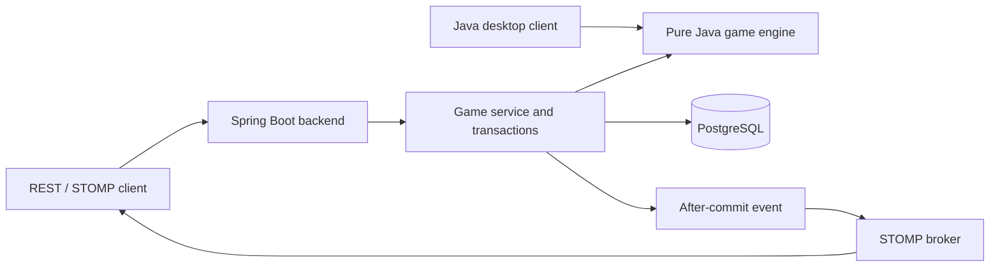

# Nine Men's Morris

[](https://github.com/hannnz1/nine-mens-morris-java/actions/workflows/ci.yml)

**A Java board game with a shared rules engine, a desktop client, and a persistent multiplayer backend.**

Originally developed as a collaborative Monash University FIT3077 project, Nine Men's Morris has been extended into a modular Java application. The desktop game and Spring Boot API use the same domain engine, while the backend handles player authorization, concurrent moves, retry-safe writes, and real-time match updates.

**Java 17 · Spring Boot · PostgreSQL · JPA / Hibernate · Flyway · STOMP / WebSocket · Maven · Docker**

[Quick start](#quick-start) · [Architecture](#architecture) · [API walkthrough](#try-the-rest-api) · [Tests](#build-and-test) · [Design documents](#design-documentation)


*The screenshot shows the original desktop client. The published backend exposes REST and STOMP interfaces; it does not yet include a browser game client.*

## Project Highlights

| Capability | Implementation | Purpose |
| --- | --- | --- |
| Shared domain model | Framework-independent Java rules engine | Keeps desktop and backend rule behavior in one place |
| Multiplayer lifecycle | Create a waiting game, join as the second player, submit actions | Separates match creation from player participation |
| Concurrent updates | Client `expectedVersion` and JPA `@Version` | Rejects stale moves instead of silently overwriting newer state |
| Retry-safe actions | Per-game idempotency keys and request fingerprints | Replays a saved response for an identical retry; rejects conflicting key reuse |
| Transactional persistence | Game state and idempotency record in one transaction | Keeps the move and its retry record consistent |
| Real-time delivery | Authenticated STOMP subscriptions; notifications after commit | Publishes committed game state to connected players |
| Player credentials | Random tokens, stored as SHA-256 digests | Authorizes actions and subscriptions without storing raw credentials |
| Reproducible development | Maven modules, automated tests, Flyway, CI and Docker Compose | Provides a repeatable build and local deployment workflow |

## Game Rules

Two players take turns placing nine pieces on a 24-position board. Completing a line of three creates a **mill**, allowing a legal opponent piece to be removed. Once placement is complete, pieces move along connected positions; a player with three pieces can fly to an empty position. The engine implements placement, movement, flying, mill formation, removal restrictions and victory conditions.

The original desktop client includes local two-player play, move hints and tutorial screens.

## Architecture



The Maven modules have deliberately different responsibilities:

- `game-engine` — immutable game state and deterministic rules with no UI, Spring, or database dependency.
- `backend` — controllers, validation, authorization, transactions, persistence, error handling, and WebSocket delivery.
- `legacy-desktop` — preserves the original UI and academic history while adapting its clicks and rendering state to `game-engine`.

The backend stores each rules-engine snapshot as JSON. Relational columns retain the fields used for identity, status filtering, concurrency, authorization, and auditing. This keeps the domain engine independent while PostgreSQL still enforces primary keys, foreign keys, unique idempotency keys, and indexed access paths.

## Quick Start

### Requirements

Choose either:

- Docker with the Compose plugin (Docker Desktop on Windows/macOS); or
- JDK 17, Maven 3.9+, and PostgreSQL 16.

### Run the Backend with Docker

Clone the repository, then start the API and database from PowerShell:

```powershell
git clone https://github.com/hannnz1/nine-mens-morris-java.git
cd nine-mens-morris-java
```

On Linux/macOS, use `cp .env.example .env` in place of `Copy-Item`; the Docker commands are unchanged.

```powershell
Copy-Item .env.example .env
# Edit .env and replace POSTGRES_PASSWORD before any shared deployment.
docker compose up --build -d
docker compose ps
Invoke-RestMethod http://localhost:8080/actuator/health
```

Flyway creates the database schema automatically. PostgreSQL data is retained in the `morris-postgres-data` named volume.

Stop the application without deleting its data:

```powershell
docker compose down
```

The API runs at `http://localhost:8080`; the health endpoint is `/actuator/health`. PostgreSQL is reachable by the backend on the Compose network and is not published to a host port by this configuration.

## Try the REST API

| Method | Endpoint | Purpose |
| --- | --- | --- |
| `POST` | `/api/v1/games` | Create a game and receive the creator's credential |
| `POST` | `/api/v1/games/{id}/join` | Join a waiting game and receive the second player's credential |
| `GET` | `/api/v1/games/{id}` | Read public game state |
| `POST` | `/api/v1/games/{id}/actions` | Apply an authorized action using a version and idempotency key |

### Two-Player Walkthrough

Keep player credentials in the local shell session; they are needed for subsequent actions.


Create a waiting game. Only White's raw credential is returned to the creator:

```powershell
$created = Invoke-RestMethod `
  -Method Post `
  -Uri http://localhost:8080/api/v1/games `
  -ContentType 'application/json' `
  -Body '{"whitePlayer":"Alice"}'

$gameId = $created.game.id
$whiteToken = $created.whiteCredential.token
$created.game
```

The second player joins separately and receives only the Black credential:

```powershell
$joined = Invoke-RestMethod `
  -Method Post `
  -Uri "http://localhost:8080/api/v1/games/$gameId/join" `
  -ContentType 'application/json' `
  -Body '{"blackPlayer":"Bob"}'

$blackToken = $joined.credential.token
$currentVersion = $joined.game.version
```

For trusted local demos, creation remains backward compatible: supplying both
`whitePlayer` and `blackPlayer` creates an immediately playable game and returns
both credentials.

Place White's first piece. `expectedVersion` prevents a stale browser from overwriting a newer move; `Idempotency-Key` prevents a network retry from applying the move twice:

```powershell
$headers = @{
  'X-Player-Token' = $whiteToken
  'Idempotency-Key' = [guid]::NewGuid().ToString()
}

Invoke-RestMethod `
  -Method Post `
  -Uri "http://localhost:8080/api/v1/games/$gameId/actions" `
  -Headers $headers `
  -ContentType 'application/json' `
  -Body (@{
    type = 'PLACE'
    from = $null
    to = 'A1'
    expectedVersion = $currentVersion
  } | ConvertTo-Json)
```

Read public game state without a token:

```powershell
Invoke-RestMethod "http://localhost:8080/api/v1/games/$gameId"
```

Actions use `PLACE`, `MOVE`, or `REMOVE`. Board positions use identifiers such as `A1`, `D1`, and `G7`. A STOMP client can connect at `/ws` and subscribe to `/topic/games/{gameId}` by including the native `X-Player-Token` header on its `SUBSCRIBE` frame.

## Run Without Docker

Create a PostgreSQL database, then provide connection variables:

```powershell
$env:DB_URL = 'jdbc:postgresql://localhost:5432/morris'
$env:DB_USERNAME = 'morris'
$env:DB_PASSWORD = 'your-password'
mvn -pl backend -am package
java -jar .\backend\target\backend-1.0.0-SNAPSHOT.jar
```

The API listens on `http://localhost:8080` by default.

## Build and Test

Run all modules and all tests:

```powershell
mvn clean verify
```

Or test inside an isolated Maven container:

```powershell
docker run --rm `
  -v "${PWD}:/workspace" `
  -w /workspace `
  maven:3.9.9-eclipse-temurin-17 `
  mvn --batch-mode --no-transfer-progress clean verify
```

The suite covers the original desktop rules, all 24 positions and 32 graph edges, placement, movement, flying, mills, removal and victory, plus API creation, validation, authorization, optimistic version conflicts, rule errors, and idempotent retries. GitHub Actions is configured to run `mvn verify` on pushes and pull requests targeting `main`. The badge links to the actual workflow status.

API integration tests use H2 in PostgreSQL compatibility mode. They do not replace testing PostgreSQL-specific concurrency and deployment behavior against a real PostgreSQL instance; no load-test throughput or latency claim is made here.

## Run the Original Desktop Game

Package and launch the executable desktop JAR:

```powershell
mvn -pl legacy-desktop -am package
java -jar .\legacy-desktop\target\legacy-desktop-1.0.0-SNAPSHOT.jar
```

Alternatively, open `Nine Man's Morris/src/Engine.java` in IntelliJ IDEA and run `Engine.main()`. Running from the original `src` directory ensures its relative tutorial-image paths resolve correctly.

## Persistence and Concurrency Design

- `game_sessions.version` is incremented by Hibernate on every successful state change.
- A client must submit the version it last read. A stale action receives HTTP `409 VERSION_CONFLICT`.
- The database version check also protects against two requests that pass application checks at nearly the same time.
- `(game_id, idempotency_key)` is unique. A retry with the same payload returns the saved response; reuse with a different payload receives HTTP 409.
- State changes and idempotency records share one database transaction.
- WebSocket notification is emitted only after the database transaction commits.

## Security Notes

- Player tokens are generated with `SecureRandom`, returned once, compared in constant time, and never stored in plaintext.
- Write endpoints and game-topic subscriptions authorize the token against the selected game; actions also enforce the active player.
- Bean Validation constrains request data; game rules are independently checked by the domain engine.
- API errors use stable codes and do not expose internal exception messages or stack traces.
- Request-header size and credential length are bounded, and the container runs as an unprivileged user.
- Secrets are supplied through environment variables; `.env` is ignored by Git and `.env.example` contains no usable production secret.

For an internet-facing production deployment, add TLS at a reverse proxy, a managed secret store, rate limiting, token expiry/rotation, centralized logs/metrics, backups, and multi-instance event delivery rather than the in-memory STOMP broker.

## Repository Layout

```text
game-engine/          Pure Java game state, board model and rules
backend/              Spring Boot API, persistence and real-time delivery
legacy-desktop/       Maven adapter for the original desktop application
Nine Man's Morris/    Original desktop source and tutorial assets
src/test/             Original desktop regression tests
.github/workflows/    Maven CI
Screenshots/          Desktop gameplay and tutorial images
Design Rationale/     Original team design documents
docker-compose.yml    Local API and PostgreSQL services
```

## Design Documentation

- [Domain model](Group43_Domain_Model.pdf)
- [Revised class diagram](<Revised Architecture/Group43_Revised_Class_Diagram.pdf>)
- [Sprint 4 design rationale](Design%20Rationale/Group_43_Sprint_4_Written_Work.pdf)
- [Sequence diagrams](<Sequence Diagrams>)
- [UI designs](<UI Design>)
- [Gameplay screenshots](Screenshots)

## Third-Party Component

Rendering and input handling use an adapted copy of Princeton University's `StdDraw`, authored by Robert Sedgewick and Kevin Wayne. See the [Princeton StdDraw documentation](https://introcs.cs.princeton.edu/java/stdlib/StdDraw.java.html) and the attribution in `Nine Man's Morris/src/View/StdDraw.java`.

## Academic Context

The original game was created by Group 43 for Monash University FIT3077 (Semester 1, 2023). This repository preserves that collaborative academic work alongside subsequent backend and shared-engine development. The GitHub history begins with the import and does not contain the original Monash GitLab commit history. The post-course backend refactor should be described separately from the original group work in applications and interviews.
