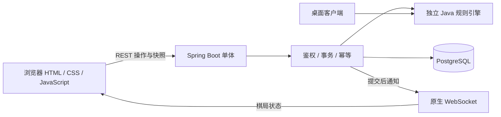

# Nine Men's Morris · 九子棋

[](https://github.com/hannnz1/nine-mens-morris-java/actions/workflows/ci.yml)

**一个可以在线双人对战的 Java 项目：独立规则引擎、Spring Boot 单体后端，以及无需前端构建的浏览器客户端。**

由 **Han Zhu** 开发，用于个人学习和 Java 面试展示。项目重点是游戏规则、并发写入、网络异常下的安全重试和会话恢复，保持单体部署，不引入超出演示需求的基础设施。

### [🎮 在线体验：morris.hanzhu-lab.online](https://morris.hanzhu-lab.online/)

无需下载客户端或注册账号。界面为中文，支持桌面和手机布局。

[在线玩法](#在线玩法) · [设计重点](#设计重点) · [架构](#架构) · [本地启动](#本地启动) · [接口契约](#接口契约) · [测试与验证](#测试与验证) · [设计文档](#设计文档)

## 在线玩法

1. 打开 [在线游戏](https://morris.hanzhu-lab.online/)，输入名字，点击 **创建并进入棋盘**，成为白方。
2. 点击 **复制邀请链接**，把链接发给另一位玩家。
3. 对方打开链接，填写名字并加入，成为黑方；白方先手。
4. 点击高亮棋位落子。三子成磨后，选择允许移除的对方棋子；移动阶段先选棋子，再选目标。

**一个人演示双端：**使用两个独立浏览器，或普通窗口与无痕窗口，分别扮演白方和黑方。不要通过复制同一标签页来模拟独立身份。

| 界面能力 | 当前行为 |
| --- | --- |
| 邀请 | 链接只包含对局编号，不包含玩家凭证；仍可手动输入编号加入 |
| 棋盘提示 | 区分可选棋子、已选棋子和目标位置 |
| 玩家信息 | 显示自己的身份、当前回合、待落棋子数和在盘棋子数 |
| 返回入口 | 保留本标签页身份，显示恢复入口 |
| 刷新与断线 | 尝试恢复身份；重连后读取最新快照，定期快照同步补偿遗漏推送 |
| 未确认操作 | 保留原请求并提供重试入口，确认前阻止新操作 |
| 连接状态 | 区分实时连接和快照同步，不将其当作对手在线状态 |

玩家凭证保存在当前标签页的 `sessionStorage` 中。关闭标签页、清除浏览器存储，或选择 **永久清除保存的玩家身份**，可能导致无法恢复席位；姓名和邀请链接不能代替身份凭证。

### 在线部署

当前演示部署在 **腾讯云香港轻量应用服务器**，通过 **Docker Compose** 运行 Spring Boot、PostgreSQL 和 Caddy。Caddy 提供 HTTPS 入口及 WebSocket 反向代理，浏览器通过 HTTPS / WSS 访问同一域名。

- 应用和数据库部署在同一台服务器，适合当前个人演示规模。
- 数据库使用持久化卷；更新应用时保留数据，并备份旧版应用和数据库。
- 云端数据库和后端服务通过容器网络通信，不直接向公网暴露数据库端口。
- 仓库中的 `docker-compose.yml` 用于**本地启动**，默认提供 `http://localhost:8080`，不包含线上域名和 Caddy 配置。
- 域名与云厂商独立，后续迁移服务器可通过调整部署和 DNS 完成，无需更改游戏协议。

这是个人演示实例，不提供持续可用性承诺。代码托管在 GitHub，在线游戏由云服务器运行，并非 GitHub Pages。

## 游戏规则

- 双方各九枚棋子，轮流放置在棋盘的 24 个交点上。
- 沿棋盘连线形成三子一线称为“磨”，可移除对方一子；优先移除不在磨中的棋子。
- 落子结束后，沿连接线移动到相邻空位；只剩三子时，可以飞到任意空位。
- 对方落子结束后不足三子，或无合法移动时获胜。

合法落子、移动、飞行、成磨、移除限制和胜负判断统一由规则引擎负责，浏览器只展示后端给出的合法操作。

## 技术栈

| 层次 | 技术 |
| --- | --- |
| 语言与构建 | Java 17、Maven 多模块 |
| 后端 | Spring Boot 3.4.13、Spring MVC、Bean Validation |
| 持久化 | Spring Data JPA / Hibernate、PostgreSQL 16 |
| 并发控制 | 按棋局的悲观行锁、短事务、`@Version`、`expectedVersion` |
| 实时通信 | 原生 WebSocket、小型 JSON 协议、REST 恢复快照 |
| 前端 | HTML、CSS、原生 JavaScript、Fetch、Web Crypto、sessionStorage |
| 数据库结构 | Flyway 版本化迁移、Hibernate `validate` |
| 测试 | JUnit、Spring Boot 集成测试、H2、Testcontainers（集成测试用真实 PostgreSQL 容器）、Node.js 前端状态测试 |
| 部署与 CI | Docker Compose、Caddy（线上）、GitHub Actions |

当前实现不依赖 STOMP、Redis、消息队列或大型前端框架。桌面客户端仍保留，并与后端共享规则引擎。

## 设计重点

### 1. 同一盘棋的写入有序执行

加入席位和提交操作时，对目标 `game_sessions` 行获取 `PESSIMISTIC_WRITE` 锁，在短 `READ_COMMITTED` 事务中验证并更新。不同棋局不共用全局锁。

`expectedVersion` 用于拒绝基于旧棋盘的操作；`@Version` 保留为状态修订号和持久化防御。悲观锁解决并发写入顺序，版本判断解决客户端视图过期，两者职责不同。

### 2. 网络重试复用原请求

一次游戏操作在发送前保存固定的幂等键、载荷和 `expectedVersion`。结果不确定时复用这些值，每轮最多尝试三次；仍未确认则保留请求，等待用户重试。

棋局更新与幂等响应在同一数据库事务内提交。相同请求重放已保存的响应；同一个键用于不同请求时拒绝。服务端先检查幂等记录，再判断版本和回合，避免成功操作的重试被当作新操作拒绝。

### 3. 数据提交与实时通知分开处理

**REST 执行游戏操作 → 数据库提交 → WebSocket 推送状态 → REST 快照恢复遗漏。**

推送异常记录日志，不把已经提交成功的操作变成接口失败。连接打开不代表鉴权成功：客户端收到 `SUBSCRIBED` 后再读取快照，并持续进行定期同步。客户端同时校验棋局 ID、会话代次和状态版本，防止迟到响应覆盖新对局。

### 4. 加入响应丢失后仍可恢复席位

客户端在加入前生成并保存随机凭证，服务端只存储其 SHA-256 哈希。相同凭证可安全重试加入；其他玩家不能仅凭姓名或对局编号冒领已分配席位。公开状态接口不返回凭证。

### 5. 规则只有一份

`game-engine` 不依赖 Spring、数据库或 UI。浏览器后端与桌面客户端共同调用它，避免为不同入口维护重复规则。桌面候选提示状态按游戏实例隔离。

## 架构



棋局规则状态以 JSON 快照持久化；关系字段维护身份、状态、版本等信息。数据库保留主键、外键和幂等唯一约束。

```text
game-engine/                         独立规则、棋盘拓扑与游戏状态
backend/                             REST、事务、持久化及 WebSocket
  src/main/resources/static/         浏览器 HTML / CSS / JavaScript
  src/main/resources/db/migration/   Flyway 版本化迁移脚本
  src/test/frontend/                 前端会话与重试回归测试
legacy-desktop/                      桌面版 Maven 构建模块
Nine Man's Morris/                   桌面源代码及教程资源
src/test/                           桌面回归测试
scripts/                            REST 与真实双客户端验证脚本
docs/                               设计取舍、API 契约及修复报告
.github/workflows/                   Java 17 / Node / PostgreSQL CI
```

## 本地启动

### 方式一：Docker Compose

需要 Git、Docker 和 Compose 插件。Windows 可以使用 Docker Desktop，并确认 Linux 容器引擎已启动。

```powershell
git clone https://github.com/hannnz1/nine-mens-morris-java.git
cd nine-mens-morris-java
Copy-Item .env.example .env
# 编辑 .env，将 POSTGRES_PASSWORD 改为自己的密码。
docker compose up --build -d
docker compose ps
Invoke-RestMethod http://localhost:8080/actuator/health
```

Linux / macOS 将 `Copy-Item` 替换为 `cp`，健康检查可用 `curl http://localhost:8080/actuator/health`。启动成功后打开 **http://localhost:8080/**。

空 PostgreSQL 数据目录首次启动时，应用启动时由 Flyway 自动执行迁移；不再需要挂载或手工执行 SQL 文件。已有库调整见[数据库说明](docs/database-initialization.zh-CN.md)。

停止应用并保留数据：

```shell
docker compose down
```

### 方式二：Java + PostgreSQL

需要 JDK 17、Maven 3.9+ 和 PostgreSQL 16。先自行创建数据库 `morris` 和对应角色；应用首次启动时会对空库自动执行 Flyway 迁移，无需手工执行 SQL：

```powershell
$env:DB_URL = 'jdbc:postgresql://localhost:5432/morris'
$env:DB_USERNAME = 'morris'
$env:DB_PASSWORD = 'your-password'
mvn -pl backend -am clean package
java -jar .\backend\target\backend-1.0.0-SNAPSHOT.jar
```

已经初始化的数据库跳过 SQL 步骤。默认端口为 8080，数据库锁等待超时通过 `DB_LOCK_TIMEOUT` 配置，默认为 `2s`。

## 接口契约

| 方法 | 路径 | 用途 |
| --- | --- | --- |
| `POST` | `/api/v1/players` | 以客户端生成的 `clientToken` 创建或恢复持久玩家身份 |
| `GET` | `/api/v1/players/me` | 使用 `Authorization: Bearer` 读取当前玩家信息 |
| `PATCH` | `/api/v1/players/me` | 使用 `Authorization: Bearer` 修改昵称 |
| `GET` | `/api/v1/players/me/games` | 使用 `Authorization: Bearer` 分页读取当前玩家的历史/进行中对局 |
| `GET` | `/api/v1/rooms/{roomCode}` | 按 6 位房间号查询对局，无需身份凭证 |
| `POST` | `/api/v1/games` | 创建白方等待局；携带 `Authorization: Bearer` 及 `Idempotency-Key` 时按持久身份创建，否则回退到创建匿名白方凭证的旧流程 |
| `POST` | `/api/v1/games/{id}/join` | 申请或恢复黑方席位；携带 `Authorization: Bearer` 及 `Idempotency-Key` 时按持久身份加入，否则回退到 `joinToken` 匿名加入的旧流程 |
| `GET` | `/api/v1/games/{id}` | 读取公开棋局状态，不含凭证 |
| `GET` | `/api/v1/games/{id}/session` | 使用 `Authorization: Bearer` 或 `X-Player-Token` 校验身份并读取快照 |
| `POST` | `/api/v1/games/{id}/actions` | 使用 `Authorization: Bearer` 或 `X-Player-Token`、幂等键和版本提交操作 |
| WebSocket | `/ws` | 鉴权后接收状态，不执行落子操作 |

`POST /api/v1/games` 与 `POST /api/v1/games/{id}/join` 现在优先通过 `Authorization: Bearer <clientToken>` 鉴权持久身份，这是新客户端的主要方式；未携带 `Authorization` 头时回退到创建前已存在的匿名流程（`X-Player-Token` / `joinToken`），仅供在此变更之前创建的对局继续使用。

匿名创建请求为 `{"whitePlayer":"Alice"}`。匿名加入请求包含 `blackPlayer` 和 `joinToken`；`joinToken` 应为密码学随机的 32 字节、URL-safe Base64 无填充字符串（43 字符），发送前持久保存。`clientToken` 采用相同格式，由客户端生成并保存，服务端只存储其哈希；持久身份下的创建与加入还需携带 `Idempotency-Key` 请求头。

操作请求示例：

```http
POST /api/v1/games/{id}/actions
Content-Type: application/json
X-Player-Token: <当前玩家凭证>
Idempotency-Key: <本次操作的固定唯一键>

{"type":"PLACE","from":null,"to":"A1","expectedVersion":1}
```

操作类型为 `PLACE`、`MOVE`、`REMOVE`。示例版本号需替换为实际读取的版本；网络重试不能生成新键或擅自更新原请求版本。

WebSocket 建立后发送：

```json
{"type":"SUBSCRIBE","gameId":"棋局 UUID","token":"玩家凭证"}
```

等待 `SUBSCRIBED` 后读取 REST 快照，后续接收 `GAME_STATE`。非法客户端消息会被拒绝。完整协议、错误码和恢复语义见[恢复设计与 API 契约](docs/recovery-design.zh-CN.md)。

## 测试与验证

### Java 与前端回归测试

```shell
mvn --batch-mode --no-transfer-progress verify
node --check backend/src/main/resources/static/app.js
node --test backend/src/test/frontend/session.test.cjs
```

前端测试需要 Node.js 22+。`mvn --batch-mode --no-transfer-progress verify` 现在会通过 Testcontainers 自动启动一个真实的 PostgreSQL 16 容器，完整运行并发测试套件——本地需要运行 Docker。

GitHub Actions 配置了 Java 17、Node.js 22；`ubuntu-latest` runner 自带的 Docker 守护进程供 Testcontainers 使用，无需额外的 `services: postgres` 配置。实际 CI 结果以[工作流页面](https://github.com/hannnz1/nine-mens-morris-java/actions/workflows/ci.yml)为准。

### 双客户端与 REST 验证脚本

启动连接**独立测试数据库**的后端后：

```powershell
$env:MORRIS_DEMO_URL = 'http://localhost:8080'
node scripts/verify-realtime.cjs
.\scripts\demo-multiplayer.ps1 -BaseUrl http://localhost:8080
```

前者使用两个隔离 JavaScript 上下文运行实际 `app.js`，通过真实 REST / WebSocket 检查状态同步、断线恢复和响应丢失后的重试；后者验证对局、成磨、移除、幂等和旧版本拒绝。两者都会创建测试棋局，不等同于图形浏览器验收。

### 最近验证记录（2026-09-17）

| 范围 | 已完成的验证 |
| --- | --- |
| 原生 WebSocket 改造 | 40 项 Java 测试通过，包含 9 项真实 PostgreSQL 测试，无跳过；双客户端协议与状态验证通过 |
| 最新前端优化 | 20 项前端行为测试通过；JavaScript 语法、页面 ID 引用、Java 17 打包和 Git 差异检查通过 |
| 云端更新 | Docker 后端更新成功；HTTPS 健康检查正常；公网三个静态文件与本地版本哈希一致；WSS 握手及无效凭证拒绝检查通过 |
| 验证限制 | 最新前端更新未重新运行全部 Java / PostgreSQL 测试；完整图形浏览器双人对局及手机视觉验收尚未完成 |

历史阶段的详细证据和限制保留在设计报告中，不将旧版本测试结果混作最新 UI 验收。

## 当前取舍与限制

- 面向单实例部署，WebSocket 连接保存在进程内，暂不支持跨实例消息分发。
- 推送不是持久化消息；快照恢复当前状态，不保证每条中间通知都能送达，也不宣称端到端“恰好一次”。
- 持久身份凭证（`clientToken`）现在保存在 `localStorage` 中，跨标签页和关闭重开仍可恢复；但浏览器站点数据被清除、且用户没有另外保存恢复码时，身份仍会永久丢失。没有跨设备身份恢复、对手在线状态、匹配系统或排行榜。
- 创建前已存在对局所依赖的 `X-Player-Token` 匿名路径计划在本次上线 30 天后移除，前提是届时不再有依赖该路径的进行中对局。
- 创建白方成功但响应丢失时，可能留下无人继续的等待局；安全重试目前重点覆盖加入和游戏操作。
- 幂等记录没有自动过期清理，适用于演示规模；清理历史记录会缩短可重放范围。
- 数据库结构变更通过 Flyway 版本化迁移管理；如果未来需要长期维护多个数据库版本，再评估更复杂的迁移策略。

## 桌面客户端

保留原有本地双人对局、提示和教程功能，与后端共享规则引擎：

```powershell
mvn -pl legacy-desktop -am package
java -jar .\legacy-desktop\target\legacy-desktop-1.0.0-SNAPSHOT.jar
```

以下为**桌面版历史截图，并非当前网页界面**：


## 设计文档

- [悲观锁设计与面试说明](docs/pessimistic-locking-design.zh-CN.md)
- [数据库初始化与已有库处理](docs/database-initialization.zh-CN.md)
- [会话恢复、幂等重试及 API 契约](docs/recovery-design.zh-CN.md)
- [原生 WebSocket 改造报告](docs/native-websocket-change.zh-CN.md)
- [前端体验调整与验证范围](docs/frontend-refresh.zh-CN.md)
- [项目修复报告](docs/repair-report.zh-CN.md)

历史图表和设计文件作为演进记录保留，当前实现以源代码及上述文档为准。

## 第三方致谢

桌面绘制与输入使用 Princeton University 的 `StdDraw` 改编版本，原作者为 Robert Sedgewick 和 Kevin Wayne。参见 [StdDraw 文档](https://introcs.cs.princeton.edu/java/stdlib/StdDraw.java.html)及源码 `Nine Man's Morris/src/View/StdDraw.java` 中的版权说明。
